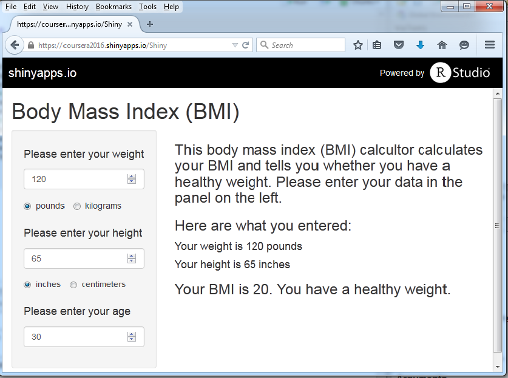

## The Algorithm (Function bmiclass)
* Fomular: $BMI=weight(kg) /(height(m))^2$
* Metric inputs for weight and height are allowed
* BMI is not claculated for individuals younger than 18 year old
* Classifies the calculated BMI to 4 categories: underweight ($BMI<18.5$), 
healthy weight ($18.5 \le BMI < 25$), overweight ($25 \le BMI <30$),
obese ($BMI >30$)
* The BMI upper bound for healthy weight is adjusted to 27 for individuals order than 65 years


```r
bmiclass(60, 165, 30)
```

```
## [1] "Your BMI is 22. You have a healthy weight."
```

--- .class #id 

## The code for ui.R


```r
library(shiny)
shinyUI(pageWithSidebar(
  headerPanel("Body Mass Index (BMI)"),
  sidebarPanel(
    numericInput("weight", label = h4("Please enter your weight"), value = 120, min=0),
    radioButtons("weightunit", label = NULL, choices = list("pounds" = 1, "kilograms" = 2),
                 selected = 1, inline=TRUE),
    numericInput("height", label = h4("Please enter your height"), value = 65, min=0),
    radioButtons("heightunit", label = NULL, choices = list("inches" = 1, "centimeters" = 2),
                 selected = 1, inline=TRUE),
    numericInput("age", label = h4("Please enter your age"), value = 30, min=0, max=120, step=1)),
  mainPanel(
    h3('This body mass index (BMI) calcultor calculates your BMI and tells you whether you 
      have a healthy weight. Please enter your data in the panel on the left.'),
    h3('Here are what you entered:'),
    h4(textOutput("oweight")), h4(textOutput("oheight")), h3(textOutput("obmi")))
))
```

--- .class #id 

## The code for server.R

```r
library(shiny)
shinyServer(
  function(input, output){
    output$oweight <- renderText({
      if (input$weightunit==1) unit <- 'pounds' else unit <- 'kilograms'
      paste('Your weight is', input$weight, unit) })
    output$oheight <- renderText({
      if (input$heightunit==1) unit <- 'inches' else unit <- 'centimeters'
      paste("Your height is", input$height, unit) })
    output$obmi <- renderText({
      weight <- input$weight; if (input$weightunit==1) weight <- input$weight*0.454
      height <- input$height; if (input$heightunit==1) height <- input$height*2.54      
      bmiclass(weight, height, input$age) })
  }
)
```

--- .class #id 

## The App (Enjoy!)




